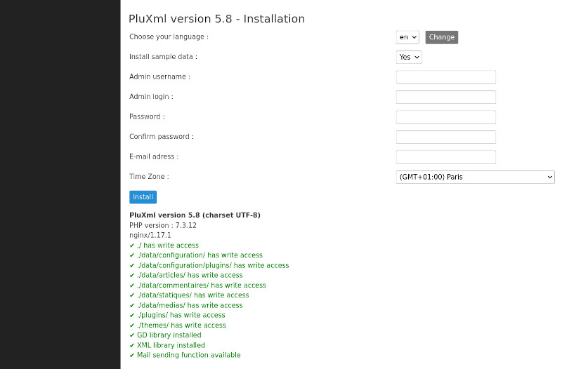
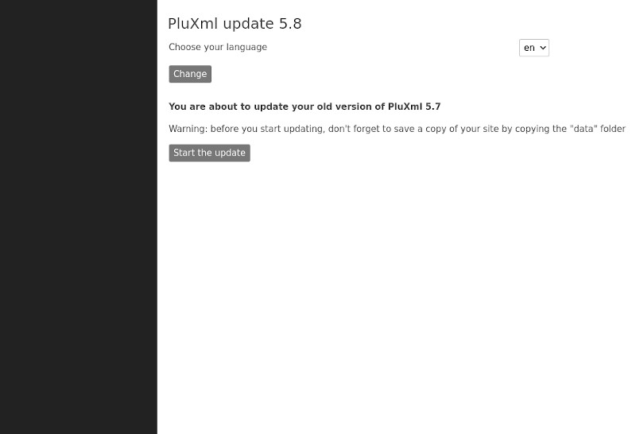
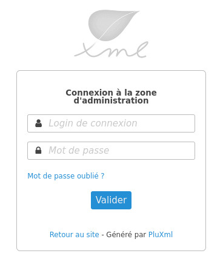
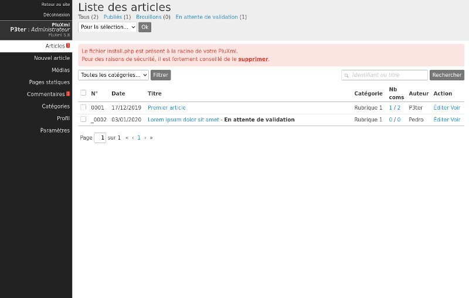

# Pré-requis et installation / Setup

## Pré-requis / Before the install
Que ce soit en local sur votre ordinateur ou sur internet, votre hébergement doit posséder les éléments suivants pour pouvoir utiliser PluXml :

* PHP 5.6 ou supérieur
* Librairie GD pour la gestion des images
* Fonction PHP d'envoi d'emails autorisée (non obligatoire)
* Le module Apache *mod_rewrite* activé pour utiliser la réécriture d'url (non obligatoire)

## Installation / Install

### Télécharger PluXml sur le site officiel / Download PluXml from official website
Téléchargez la dernière version sur http://pluxml.org

### Installer PluXml en local sur son ordinateur / Install PluXml locally on your computer
Nous allons installer un serveur web de type AMP (Apache MySQL PHP). L'installation de MySQL n'est pas nécessaire dans le cas présent, PluXml fonctionnant sans base de données. Bien sûr, vous pouvez aussi utiliser NGINX à la place d’Apache.

#### Sous MAC OS
* Télécharger le logiciel MAMP sur http://www.mamp.info/en/index.html.
* Installer MAMP en copiant le dossier dans */Applications*.
* Lancer le logiciel, la fenêtre de l’application s’ouvre.
* Afin d'éviter la perte de données au moment de la mise à jour de MAMP, ouvrir les préférence de MAMP et dans l'onglet Apache saisir le chemin vers le dossier
*Sites* présent à la racine de votre compte utilisateur. Ce chemin est du
type */Users/votrenom/Sites*.
* Décompresser l'archive pluxml-lastest.zip précédemment téléchargée.
* Ouvrir le dossier */Sites/*.
* Glisser le dossier *PluXml* dans ce répertoire */Sites/*.
* Ouvrir votre navigateur à l’adresse suivante : http://localhost:8888/pluxml/.
* Suivre la procédure d’installation

#### Sous Linux
* Installer les outils LAMP : pour Ubuntu/Debian[1], Fedora[2] ou ArchLinux[3].
* Décompresser l'archive pluxml-lastest.zip précédemment téléchargée.
* Ouvrir le dossier */var/www/*.
* Envoyer ou faire glisser le contenu du dossier pluxml dans le dossier de destination.
* Ouvrir votre navigateur à l’adresse : http://localhost ou http://127.0.0.1
* Suivre la procédure d’installation.

!!! note
    [1] Ubuntu/Debian : [http://doc.ubuntu-fr.org/lamp](http://doc.ubuntu-fr.org/lamp)

    [2] Fedora : [http://doc.fedora-fr.org/wiki/LAMP](http://doc.fedora-fr.org/wiki/LAMP)

    [3] ArchLinux : [http://wiki.archlinux.fr/LAMP](http://wiki.archlinux.fr/LAMP)

#### Sous Windows
* Télécharger le logiciel EasyPHP sur http://www.easyphp.org/.
* Installer EasyPHP.
* Décompresser l'archive pluxml-lastest.zip précédemment téléchargée.
* Lancer EasyPHP, puis aller sur l'icône en bas à droite dans la barre de tâche.
* Cliquer-droit sur l’icône, puis allez sur Explore (ce qui ouvre le dossier www).
* Déplacez le contenu du dossier PluXml dans ce dossier *www*.
* Cliquez-droit sur l’icôneEasyPHP, puis sur local web pour ouvrir votre navigateur.
* Suivre la procédure d’installation.

### Installer PluXml sur son hébergeur / Install PluXml on your webhost
* Décompresser l'archive pluxml-latest.zip sur votre ordinateur.
* Ouvrir votre logiciel de transfert FTP (Filezilla, SmartFTP, ...).
* Se connecter à votre hébergement, via votre compte FTP.
* Envoyer ou faire glisser le contenu du dossier *PluXml* dans le dossier de destination chez votre hébergeur (classiquement le dossier *www*).
* Ouvrir votre navigateur sur l’adresse de votre site.
* Suivre la procédure d’installation.

!!! danger "Important"
    Pour fonctionner chez votre hébergeur, en règle générale, il faut que les droits en lecture/écriture soient définis de la manière suivante :

    * Propriétaire : rwx (tout)
    * Groupe : r-x
    * Tous : r-x

    (chmod -R 755 PluXml)

!!! note
    Si vous rencontrez des difficultés pour installer et utiliser PluXml sur un hébergeur (Free, OVH, ...), vous trouverez plusieurs éléments de réponses sur [cette page](hebergeurs.md).

### Installer PluXml sur un serveur dédié avec NGINX / Install PluXml on a dedicated server with NGINX

Si vous souhaitez installer PluXml sur un serveur dédié derrière un serveur web NGINX, vous pouvez vous référer à la page ci-dessous :

[Configuration NGINX pour PluXml](nginx.md)

### Installer PluXml depuis le dépôt Debian/Ubuntu / Install PluXml from the Debian/Ubuntu package

PluXml est disponible sous la forme d'un paquet Debian/Ubuntu, maintenu par la communauté.

[Cliquer ici pour en savoir plus](debian.md)

# L'Arborescence / Tree structure

    - core : le cœur de Pluxml
      - admin : les fichiers de l’administration
      - lang : les dix langues gérées par PluXml
      - lib : les fonctionnalités globales de PluXml
      - templates : les templates utilisé par PluXml (exemple : mail de mot de passe oublié)
      - vendor : librairies externes importées avec Composer (exemple : PHPMailer)
    - data : les paramètres, documents, images et autres
      - articles : contient tous les articles
      - commentaires : contient tous les commentaires
      - configuration : contient les divers fichiers de configuration de PluXml et des plugins
      - medias : contient les images ou autres documents envoyés par le gestionnaire de médias
      - statiques : contient toutes les pages statiques du site
      - templates : contient des templates utilisables, par exemple, pour l'envoi d'e-mails (répertoire à créer si nécessaire)
    - plugins : contient la liste des plugins
    - readme : contient des fichiers d’information sur la licence de PluXml, les auteurs, et les derniers changements et évolutions
    - themes : le ou les thèmes du site
      - defaut : le thème par défaut fourni avec PluXml
    - update : les fichiers de mise à jour des différentes versions
    - config.php : le fichier qui indique où se trouve la configuration de PluXml
    - feed.php : le fichier de gestion du flux rss
    - index.php : le fichier qui permet l’affichage du site
    - install.php : fichier d’installation
    - sitemap.php : le fichier de construction du sitemap

# Mise à jour / Update

## Sauvegarder ses données / Save your data
Avant une mise à jour de PluXml, il faut par précaution, sauvegarder votre site web. La procédure est la même pour une sauvegarde régulière.

PluXml n’ayant pas de base de données, la sauvegarde est très simple. Tous les fichiers de PluXml sont dans un seul et même dossier, qui correspond à la racine de votre site web. Il suffit de sauvegarder ce dossier racine, par exemple, en local sur votre ordinateur, sur une clé USB ou sur un autre support externe.

Ainsi, si votre site se trouve dans le répertoire /var/www/pluxml, il suffit de faire une copie du dossier pluxml.

Si vous souhaitez sauvegarder uniquement les articles, les commentaires, les pages statiques et la
configuration du site et des plugins, une copie du répertoire /var/www/pluxml/data suffit.

## Lancer la mise à jour / launch the update

!!! danger "Important"
    Assurez-vous d’avoir fait une sauvegarde de votre site avant de mettre à jour PluXml (voir *Sauvegarder ses données*).

Suivre les étapes ci-dessous pour effectuer la mise à jour :

- Télécharger la nouvelle version de PluXml sur pluxml.org.
- Décompresser l'archive pluxml-lastest.zip précédemment téléchargée.
- Sélectionner tout le contenu de l’archive, sauf les dossiers data, plugins et themes.
- Déposer tout le contenu sélectionné à la racine du site en écrasant les anciens fichiers.
- Se connecter à l’adresse du site avec un navigateur internet et suivre les instructions pour lancer la mise à jour.

# Accéder à la l'administration / access to the admin panel

PluXml installé, vous pouvez accéder à l’administration du site. Avec le thème par défaut, le lien
Administration pour se connecter à la zone d'administration est affiché tout en bas de votre site.

!!! note
    Retenez l’URL car elle vous permettra d'accéder à votre administration si vous modifiez votre thème
    et ne désirez pas laisser apparaître ce lien.

Le login de connexion et le mot de passe sont ceux que vous avez définis lors de l’installation.

# Réinitialiser le mot de passe admin / Reset the password for admin

!!! note
    La procédure suivante, vous permettra de réinitialiser votre mot de passe admin, dans le cas ou la procédure "mot de passe" oublié via l'envoi d'un e-mail n'a pas fonctionné.

__Récupérer un nouveau mot de passe__

Prés-requis : avoir une deuxième installation de PluXml avec un mot de passe connu.

Ouvrir le fichier *data/configuration/users.xml* d'une deuxième installation de PluXml dont ont connait le mot de passe.

Récupérer le mot de passe chiffré en copiant la ligne *password*. Récupérer aussi le champ *salt.

    <?xml version="1.0" encoding="UTF-8"?>
    <document>
        <user number="001" active="1" profil="0" delete="0">
            <login><![CDATA[Admin]]></login>
            <name><![CDATA[Administrateur]]></name>
            <infos><![CDATA[]]></infos>
            <password><![CDATA[ws62plm739c90d34c051a490031e9f583271811b]]></password>
            <salt><![CDATA[rtQdDhChTY]]></salt>
            <email><![CDATA[]]></email>
            <lang><![CDATA[fr]]></lang>
        </user>
    </document>

__Remplacer le mot de passe perdu__

Ouvrir le fichier *data/configuration/users.xml* sur le site dont le mot de passe est perdu. Remplacer les lignes *password* et *salt* par les lignes récupérées ci-dessus sur votre deuxième installation de PluXml.

Enregistrer et vous pourrez désormais vous connecter dans la zone d'administration avec le mot de passe copié. Pour le modifier, aller dans l'administration, à la section "Profil".

# Recommandation après une installation ou une mise à jour / Highly recommended after an install or an update

Après une installation ou une mise à jour, par mesure de sécurité, supprimez le fichier install.php et le dossier update qui se trouvent à la racine de votre site.

Le cas échéant un message s’affichera dans l’administration du site. Cliquez sur le bouton « supprimer » pour effacer le fichier install.php.

